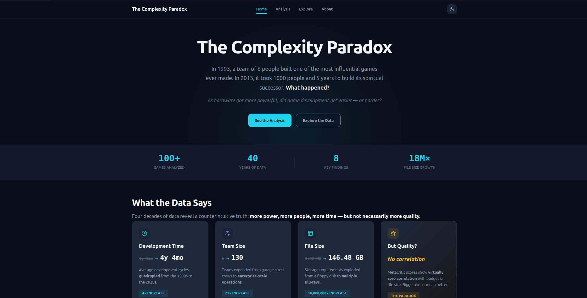
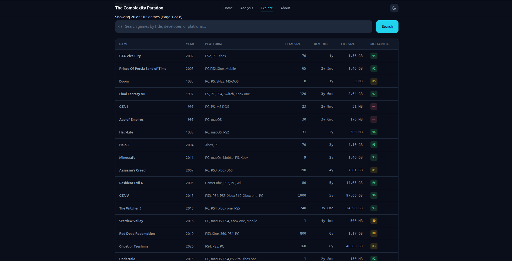
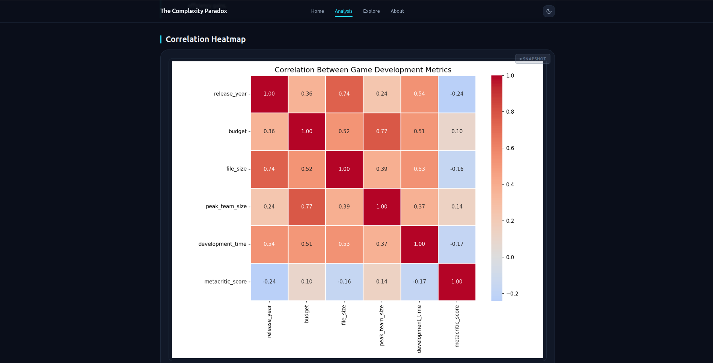

# The Complexity Paradox

A full-stack data analysis project exploring whether game development has actually gotten easier as technology has improved — or harder. Built on 100+ games spanning four decades (1980s–2020s), with searchable data and interactive charts.

🔗 [Live Demo](your-deployed-url-here)

## About the Project

As computers got exponentially more powerful, did game development get easier or harder? The data says: despite better tools, larger teams, and bigger budgets, the complexity of building a great game has only increased.

This project collects and analyzes data across development team size, total dev time, file size, Metacritic scores, and budget (where available) to explore that trend.

## Features

- **Search** — find games by name, developer, or platform on the Explore page
- **Paginated game table** — browse the full dataset on the Explore page
- **Game detail pages** — click any game's name to view its full details
- **Live charts** — Chart.js visualizations pulling fresh data from the database on every page load
- **Static analysis charts** — deeper exploratory visualizations generated via a Python analysis script
- **Internal data management tooling** — a protected interface for maintaining and expanding the dataset

## Tech Stack

- **Backend:** Python, Flask
- **Database:** Turso (libSQL/SQLite-compatible, hosted)
- **Templating:** Jinja2
- **Frontend:** Vanilla JavaScript, Vanilla CSS
- **Data Visualization:** Chart.js (live), Matplotlib/Seaborn (static analysis)
- **Data Processing:** Pandas, NumPy
- **Hosting:** Render

## Project Structure

```
├── data/                   # SQLite database and source Excel data
├── notebooks/              # Jupyter notebooks for exploration + generate_charts.py
├── outputs/                # Generated static chart images
├── scripts/                # CLI tools (add_game.py, setup_database.py, db_connect.py)
├── utils/                  # Shared logic (validators, formatters, bulk import)
└── website/
    ├── static/             # CSS, JS, images
    ├── templates/          # Jinja2 HTML templates
    └── app.py              # Flask application
```

## Getting Started

### Prerequisites
- Python 3.10+
- pip
- A free [Turso](https://turso.tech) account and database

### Installation

1. Clone the repository
   ```bash
   git clone <https://github.com/RathodArun477/the-complexity-paradox>
   cd the-complexity-paradox
   ```

2. Create and activate a virtual environment
   ```bash
   python -m venv game_venv
   source game_venv/bin/activate  # On Windows: game_venv\Scripts\activate
   ```

3. Install dependencies
   ```bash
   pip install -r requirements.txt
   ```

4. Set up environment variables

   Create a `.env` file in the project root:
   ```
   ADMIN_KEY=your-secret-key
   SECRET_KEY=your-flask-secret-key
   TURSO_DATABASE_URL=your-turso-database-url
   TURSO_AUTH_TOKEN=your-turso-auth-token
   ```
    > **Note:** This file is excluded from version control (see `.gitignore`) and is only used locally to run the app. You'll need your own Turso database and credentials — see [Turso's docs](https://docs.turso.tech) to get started.

5. Run the app
   ```bash
   cd website
   python app.py
   ```

   Visit `http://localhost:5000` in your browser.

## Screenshots






## Methodology

Data was collected on 100+ games spanning the 1980s to the 2020s, tracking development team size at peak production, total development time, final file size, Metacritic score (as a quality proxy), and budget estimates where publicly available. Sources include public developer interviews, GDC postmortems, industry reports, and official documentation. Where exact figures were unavailable, the most reliable estimates from multiple sources were used.

## Author

**Arun Rathod**
Data Science student passionate about uncovering the stories hidden in data.
